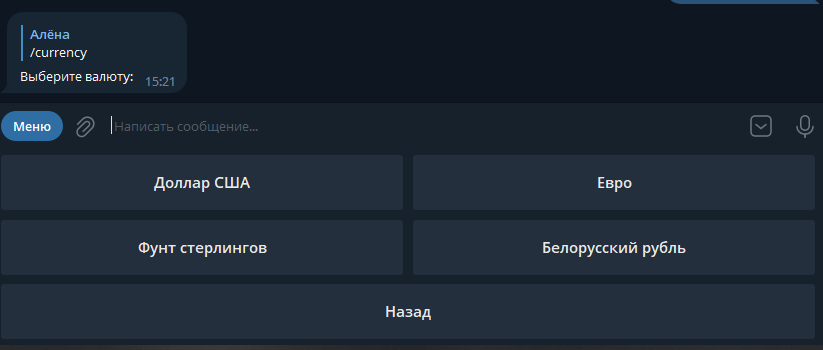
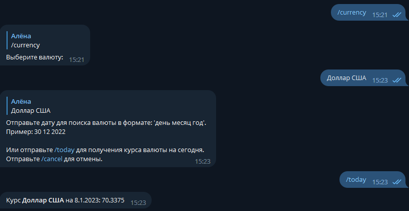

# currency-rate-tg-bot
Телеграм бот для отправки пользователю официального курса доллара, евро, фунтов, Белорусского рубля.  
Бот отправляет официальный курс валют на выбранный день с сайта ЦБ.  

Бот работает асинхронно и взаимодействует с Telegram в режиме `polling` (сервер->Telegram) / 
`webhook` (Telegram->сервер, более быстрая работа, нужен SSL сертификат).

## Список команд бота:
- **/start** - начать общение с ботом  

- **/currency** - открывается inline-клавиатура с выбором валюты. Бот попросит ввести дату для получения курса валюты.  

Сообщение от бота после нажатия inline-кнопки:


## Настройка окружения
1. Форкните репозиторий, затем склонируйте.
2. Перейдите в папку с проектом:  
`cd currency-rate-tg-bot`
3. Добавьте в **.env** файл токен бота `BOT_TOKEN`, полученный у [BotFather](https://t.me/BotFather).
3. 1. (Рекомендуется) Для работы в режиме polling добавьте в **.env** `SENDING_TYPE=polling` .
3. 2. (Либо) Для взаимодействия с Telegram webhook необходимо настроить SSL сертификат на сервере по 
[инструкции](https://serverspace.ru/support/help/lets-encrypt-ubuntu-20-04/). Используйте nginx для установки 
сертификата. После генерации сертификата создастся 2 файла: **privkey.pem** и **fullchain.pem**, которые будут 
использоваться при запуске uvicorn. Также добавьте в .env файл `SENDING_TYPE=webhook` и url сервера `WEBHOOK_URL`.

## Запуск локально
1. Настройте окружение по инструкции.
2. Установите необходимые библиотеки:  
`pip install -r requirements.txt`
3. Запустите сервер:
- При работе с polling:  
`uvicorn app.main:app`
- При работе с webhook:
- `uvicorn app.main:app --host 0.0.0.0 --port 443`

## Запуск в Docker
После настройки окружения запустите бота в Docker:
```shell
docker-compose up -d --build
```
